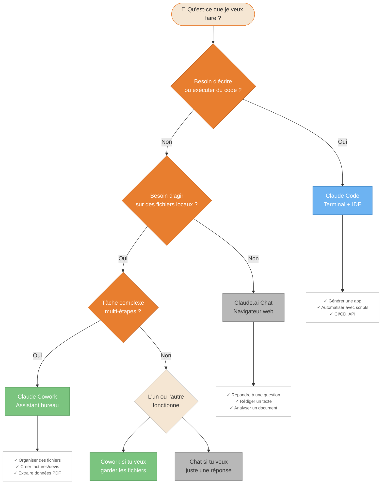
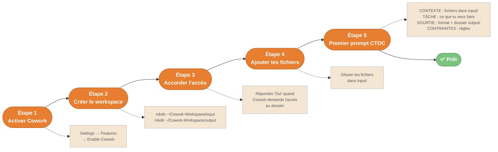
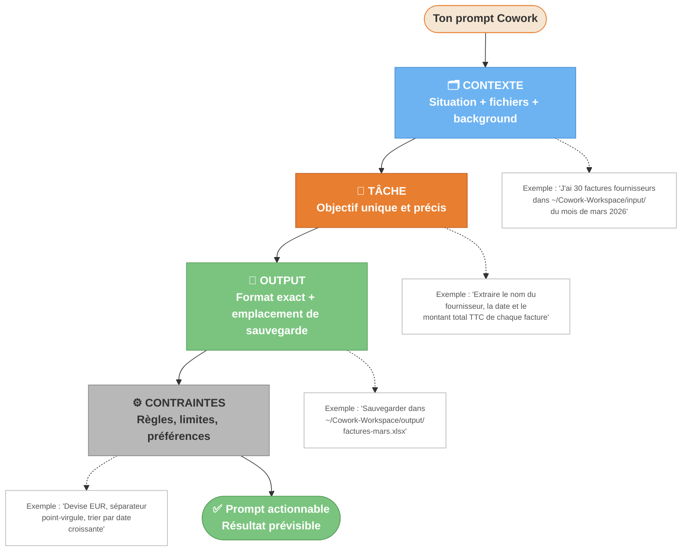

---
---
---
title: "Diagrammes — Prise en main"
description: "5 diagrammes : Cowork vs Chat vs Code, setup workspace, anatomie CTOC, choix du modèle, décision d'usage Cowork"
tags: [getting-started, ctoc, workspace, decision, modele]
---

# Prise en main — Diagrammes

3 diagrammes pour répondre à la question de départ : qu'est-ce que Cowork, comment démarrer, comment structurer ses prompts.

---

## D01 — Cowork vs Chat vs Code : lequel utiliser ? {#d01}

**Quand l'utiliser** : tu hésites entre les trois onglets de Claude. Ce diagramme guide le choix selon ce que tu veux faire.



<details>
<summary>Fallback ASCII</summary>

```
[Qu'est-ce que je veux faire ?]
            |
  Besoin de code ?
   /          \
 Oui          Non
  |            |
[Claude      Agir sur fichiers locaux ?
 Code]        /          \
            Oui          Non
             |            |
       Tâche complexe?  [Chat]
         /     \
       Oui     Non
        |       |
   [Cowork]  [L'un ou l'autre]
```
</details>

---

## D02 — Setup workspace en 5 étapes {#d02}

**Quand l'utiliser** : tu viens d'activer Cowork et tu veux démarrer proprement du premier coup.



<details>
<summary>Fallback ASCII</summary>

```
[Activer] → [Créer workspace] → [Accorder accès] → [Ajouter fichiers] → [Premier prompt] → ✅

Étape 1 : Settings → Features → Enable Cowork
Étape 2 : mkdir ~/Cowork-Workspace/{input,output}
Étape 3 : Répondre Oui à la demande d'accès dossier
Étape 4 : Glisser fichiers dans input/
Étape 5 : Utiliser le framework CTOC
```
</details>

---

## D03 — Anatomie d'un prompt CTOC {#d03}

**Quand l'utiliser** : tu veux écrire un prompt qui marche du premier coup. CTOC = Contexte → Tâche → Output → Contraintes.



<details>
<summary>Fallback ASCII</summary>

```
CTOC — Structure d'un prompt efficace
======================================

C — CONTEXTE  : Situation, fichiers concernés, background métier
T — TÂCHE     : Un objectif clair et unique
O — OUTPUT    : Format de sortie + chemin de sauvegarde exact
C — CONTRAINTES : Règles, devise, format date, langue...

Exemple complet :
  CONTEXTE : J'ai 30 factures dans ~/Cowork-Workspace/input/ (mars 2026)
  TÂCHE : Extraire fournisseur, date, montant TTC de chaque facture
  OUTPUT : Sauvegarder ~/Cowork-Workspace/output/factures-mars.xlsx
  CONTRAINTES : EUR, séparateur ; , tri date croissante
```
</details>

---

## D04 — Choisir le bon modèle Claude {#d04}

**Quand l'utiliser** : tu ne sais pas si utiliser Claude Opus, Sonnet ou Haiku pour ta tâche.

> Pour la plupart des usages TPE/PME, Sonnet est le bon défaut.

```mermaid
flowchart TD
    Start([🤔 Quelle tâche veux-tu faire ?]):::start

    Start --> Q1{La tâche demande\nde la réflexion profonde ?\n(analyse, stratégie,\nrédaction longue complexe)}:::decision

    Q1 -- Oui --> Opus["🔵 Claude Opus\nAnalyses stratégiques\nRédactions longues et nuancées\nRaisonnement complexe multi-étapes"]:::cowork

    Q1 -- Non --> Q2{La tâche est\nstandard et bien définie ?\n(extraction, génération doc,\nrelance, résumé structuré)}:::decision

    Q2 -- Oui --> Sonnet["🟠 Claude Sonnet\nUsage recommandé par défaut\nRapide + capable pour 90% des tâches\nBon équilibre qualité / coût"]:::doc

    Q2 -- Non --> Q3{La tâche est\nsimple et rapide ?\n(reformatter, trier,\nrésumer en 3 lignes)}:::decision

    Q3 -- Oui --> Haiku["⚪ Claude Haiku\nTri, reformatage, résumé court\nParfait si tu as du volume\nLe moins coûteux"]:::human

    Q3 -- Non --> Sonnet

    Opus --> Budget{Tu as beaucoup\nde volume à traiter ?}:::decision
    Budget -- Oui --> Tip["💡 Astuce : utiliser Haiku\npour les tâches simples en volume\net Opus ou Sonnet\npour les tâches clés"]:::doc
    Budget -- Non --> End1([✅ Modèle choisi]):::end

    Sonnet --> End2([✅ Modèle choisi]):::end
    Haiku --> End3([✅ Modèle choisi]):::end
    Tip --> End4([✅ Modèle choisi]):::end

    classDef start fill:#7BC47F,stroke:#5a9e5a,color:#fff,font-weight:bold
    classDef end fill:#7BC47F,stroke:#5a9e5a,color:#fff,font-weight:bold
    classDef cowork fill:#E87E2F,stroke:#c06020,color:#fff
    classDef decision fill:#6DB3F2,stroke:#4a90d0,color:#fff,font-weight:bold
    classDef doc fill:#F5E6D3,stroke:#E87E2F,color:#333
    classDef human fill:#B8B8B8,stroke:#888,color:#333
    classDef alert fill:#E85D5D,stroke:#c04040,color:#fff
```

<details>
<summary>Fallback ASCII</summary>

```
[Quelle tâche veux-tu faire ?]
             |
   Réflexion profonde requise ?  (analyse, stratégie, rédaction complexe)
    /                   \
  Oui                   Non
   |                     |
[Opus]         Tâche standard et bien définie ?  (extraction, génération doc)
               /                    \
             Oui                    Non
              |                      |
          [Sonnet]          Tâche simple et rapide ?  (tri, reformatage)
                             /               \
                           Oui              Non
                            |                |
                         [Haiku]         [Sonnet]

MODÈLES EN RÉSUMÉ
=================
Opus   → Analyses, stratégie, rédaction longue et nuancée
Sonnet → Défaut recommandé — rapide, capable, 90% des tâches
Haiku  → Tri, reformatage, résumé court, volume important

Note : Pour la plupart des usages TPE/PME, Sonnet est le bon défaut.
```
</details>

---

## D05 — Dois-je utiliser Cowork pour cette tâche ? {#d05}

**Quand l'utiliser** : tu as une tâche à faire et tu te demandes si ça vaut le coup de la prompter ou de la faire manuellement.

```mermaid
flowchart TD
    Start([🤔 J'ai une tâche à faire.\nCowork ou pas ?]):::start

    Start --> Q1{Temps pour faire\ncela manuellement\n> 15 minutes ?}:::decision

    Q1 -- Oui --> UseIt1["✅ Probablement oui\nCowork va te faire gagner du temps"]:::cowork

    Q1 -- Non --> Q2{La tâche revient\nchaque semaine\nou chaque mois ?}:::decision

    Q2 -- Oui --> UseIt2["✅ Oui — la tâche est répétitive\nCowork + template = gain cumulé"]:::cowork

    Q2 -- Non --> Q3{La tâche implique\ndes données personnelles\nsensibles ?}:::decision

    Q3 -- Oui --> Security["⚠️ Voir WP-09 sécurité\navant de décider\n(chiffrement, accès, conformité)"]:::alert

    Q3 -- Non --> Q4{La tâche a fort enjeu\nrelationnel ou créatif\n(discours, condoléances,\nnégociation sensible) ?}:::decision

    Q4 -- Oui --> NoUse1["❌ Non — tâche humaine\nCowork peut préparer des éléments\nmais pas remplacer le jugement"]:::alert

    Q4 -- Non --> Q5{La tâche relève\nd'un conseil réglementé ?\n(juridique, médical, financier)}:::decision

    Q5 -- Oui --> NoUse2["❌ Non — hors périmètre\nConsulter un professionnel qualifié"]:::alert

    Q5 -- Non --> Q6{L'output attendu\nest clair et défini ?}:::decision

    Q6 -- Oui --> UseIt3["✅ Oui — tâche bien définie\nRédiger un prompt CTOC et go"]:::cowork

    Q6 -- Non --> Clarify["🔄 Clarifier d'abord\nQue veux-tu exactement ?\nQuel format, quelle longueur ?\nPour qui ?"]:::human

    Clarify --> Q6

    UseIt1 & UseIt2 & UseIt3 --> Prompt([📝 Rédiger le prompt CTOC\net lancer Cowork]):::end

    classDef start fill:#7BC47F,stroke:#5a9e5a,color:#fff,font-weight:bold
    classDef end fill:#7BC47F,stroke:#5a9e5a,color:#fff,font-weight:bold
    classDef cowork fill:#E87E2F,stroke:#c06020,color:#fff
    classDef decision fill:#6DB3F2,stroke:#4a90d0,color:#fff,font-weight:bold
    classDef doc fill:#F5E6D3,stroke:#E87E2F,color:#333
    classDef human fill:#B8B8B8,stroke:#888,color:#333
    classDef alert fill:#E85D5D,stroke:#c04040,color:#fff
```

<details>
<summary>Fallback ASCII</summary>

```
[J'ai une tâche. Cowork ou pas ?]
              |
  Temps manuel > 15 min ?
   /                \
 Oui                Non
  |                  |
✅ Oui          Tâche répétitive (semaine/mois) ?
                /              \
              Oui              Non
               |                |
           ✅ Oui       Données personnelles sensibles ?
                         /                 \
                       Oui                Non
                        |                  |
                  ⚠️ Voir WP-09    Fort enjeu relationnel ou créatif ?
                                    /                  \
                                  Oui                 Non
                                   |                   |
                               ❌ Non          Conseil réglementé ?
                                               /             \
                                             Oui             Non
                                              |               |
                                          ❌ Non      Output clair et défini ?
                                                       /            \
                                                     Oui            Non
                                                      |              |
                                                  ✅ Oui       [Clarifier d'abord]
                                                      |              |
                                                      |           (loop)
                                                      |
                                         [Rédiger le prompt CTOC et lancer Cowork]

RÈGLE SIMPLE
============
✅ Cowork si : > 15 min, répétitif, output défini
❌ Pas Cowork si : enjeu relationnel fort, conseil réglementé, tâche floue
⚠️ Vérifier d'abord si : données sensibles
```
</details>
