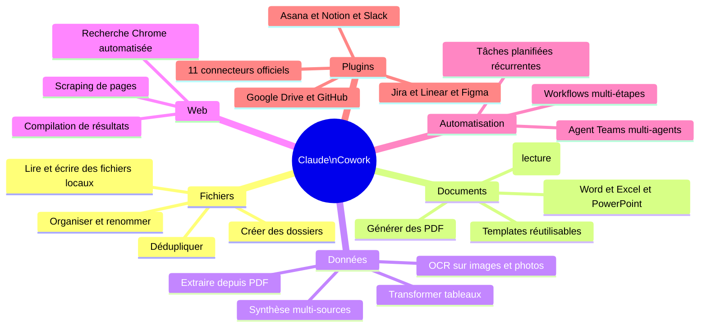
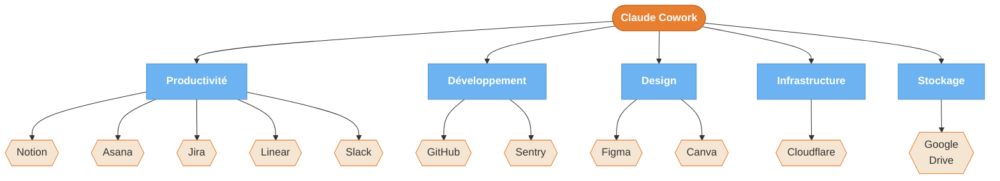

---
---
---
title: "Diagrammes — Capacités"
description: "3 diagrammes : carte des capacités, écosystème 11 plugins, patterns d'automatisation planifiée"
tags: [capabilities, plugins, features, automation, scheduled]
---

# Capacités — Diagrammes

3 diagrammes pour comprendre ce que Cowork peut faire, comment les plugins l'étendent, et comment orchestrer des automatisations récurrentes.

---

## D06 — Carte des capacités {#d06}

**Quand l'utiliser** : tu veux savoir si Cowork peut faire X avant de t'y mettre.



<details>
<summary>Fallback ASCII — Ce que Cowork PEUT faire</summary>

```
PEUT FAIRE
├── Fichiers        : lire, écrire, organiser, renommer, dédupliquer
├── Documents       : créer Word/Excel/PowerPoint, lire PDF, générer PDF
├── Données         : OCR images, extraire PDF, transformer tableaux
├── Web             : recherche Chrome automatisée, compilation résultats
├── Automatisation  : tâches planifiées, Agent Teams, workflows multi-étapes
└── Plugins         : 11 connecteurs (Notion, Slack, Drive, GitHub, Jira...)

NE PEUT PAS FAIRE
├── Exécuter du code ou des scripts
├── Appels API directs (sauf via plugins)
├── Accéder au cloud sans plugin
├── Traiter audio/vidéo
├── Fonctionner avec un VPN actif
├── Tourner en arrière-plan
└── Fonctionner sur Linux
```
</details>

---

## D09 — Écosystème des 11 plugins officiels {#d09}

**Quand l'utiliser** : tu utilises déjà un outil (Notion, Slack, GitHub...) et tu veux savoir si Cowork peut s'y connecter directement.



<details>
<summary>Fallback ASCII</summary>

```
Claude Cowork — 11 Plugins officiels
=====================================

Productivité  : Notion | Asana | Jira | Linear | Slack
Développement : GitHub | Sentry
Design        : Figma  | Canva
Infrastructure: Cloudflare
Stockage      : Google Drive

Usage : brancher un plugin via Settings → Integrations
Cowork peut alors lire/écrire directement dans ces outils
sans copier-coller manuel.
```
</details>

---

## D10 — Patterns d'automatisation planifiée {#d10}

**Quand l'utiliser** : tu veux mettre en place des tâches récurrentes que Cowork exécute automatiquement, sans intervention manuelle à chaque fois.

```mermaid
flowchart TD
    A([Tâche récurrente\nidentifiée]):::start --> B{Fréquence ?}:::decision

    B -->|Quotidienne| C[Tâches légères\nsuivi, tri, rappels]:::category
    B -->|Hebdomadaire| D[Tâches moyennes\nbilans, rapports, relances]:::category
    B -->|Mensuelle| E[Tâches lourdes\ncomptabilité, inventaire]:::category

    C --> C1[Exemple : classer\nles emails reçus\ndu jour]:::example
    C --> C2[Exemple : vérifier\nles alertes stock\ncritiques]:::example

    D --> D1[Exemple : générer\nrapport hebdo\nactivité]:::example
    D --> D2[Exemple : relances\nfactures non payées]:::example
    D --> D3[Exemple : publier\nposts réseaux sociaux]:::example

    E --> E1[Exemple : extraction\nnotes de frais mois]:::example
    E --> E2[Exemple : bilan\nstock et commandes]:::example

    C1 & C2 & D1 & D2 & D3 & E1 & E2 --> F{Comment\nplanifier ?}:::decision

    F -->|macOS| G[Créer un script\ndans Automator ou\ncron + prompt Cowork]:::tech
    F -->|Windows| H[Planificateur de tâches\nWindows + prompt Cowork]:::tech
    F -->|Sans technique| I[Rappel calendrier\n→ ouvrir Cowork\n→ copier-coller le prompt]:::human

    G & H & I --> J[Prompt sauvegardé\ndans bibliothèque interne]:::doc
    J --> K([Tâche automatisée\nou semi-automatisée]):::end

    classDef start fill:#E87E2F,stroke:#c06020,color:#fff,font-weight:bold
    classDef end fill:#7BC47F,stroke:#5a9e5a,color:#fff,font-weight:bold
    classDef decision fill:#6DB3F2,stroke:#4a90d0,color:#fff,font-weight:bold
    classDef category fill:#6DB3F2,stroke:#4a90d0,color:#fff
    classDef example fill:#F5E6D3,stroke:#E87E2F,color:#333
    classDef tech fill:#B8B8B8,stroke:#888,color:#333
    classDef human fill:#B8B8B8,stroke:#888,color:#333
    classDef doc fill:#F5E6D3,stroke:#6DB3F2,color:#333
```

<details>
<summary>Fallback ASCII — Patterns d'automatisation planifiée</summary>

```
AUTOMATISATION PLANIFIÉE
=========================

Quotidien (tâches légères)
  ├── Classer les emails du jour
  └── Vérifier alertes stock critiques

Hebdomadaire (tâches moyennes)
  ├── Rapport hebdo d'activité
  ├── Relances factures impayées
  └── Publier posts réseaux sociaux

Mensuel (tâches lourdes)
  ├── Extraction notes de frais
  └── Bilan stock et commandes

Comment planifier ?
  Technique : cron / Automator / Planificateur Windows
  Sans technique : rappel calendrier + prompt copié-collé
  Clé : prompt sauvegardé dans ta bibliothèque interne

Principe : le prompt ne change pas, seuls les fichiers changent.
"Traite tous les fichiers dans input/mois-en-cours/"
```
</details>
