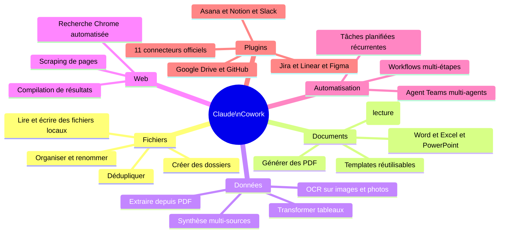

# Capacités — Diagrammes

2 diagrammes pour comprendre ce que Cowork peut faire et comment les plugins l'étendent.

---

## D06 — Carte des capacités {#d06}

**Quand l'utiliser** : tu veux savoir si Cowork peut faire X avant de t'y mettre.



<details>
<summary>Fallback ASCII — Ce que Cowork PEUT faire</summary>

```
PEUT FAIRE
├── Fichiers        : lire, écrire, organiser, renommer, dédupliquer
├── Documents       : créer Word/Excel/PowerPoint, lire PDF, générer PDF
├── Données         : OCR images, extraire PDF, transformer tableaux
├── Web             : recherche Chrome automatisée, compilation résultats
├── Automatisation  : tâches planifiées, Agent Teams, workflows multi-étapes
└── Plugins         : 11 connecteurs (Notion, Slack, Drive, GitHub, Jira...)

NE PEUT PAS FAIRE
├── Exécuter du code ou des scripts
├── Appels API directs (sauf via plugins)
├── Accéder au cloud sans plugin
├── Traiter audio/vidéo
├── Fonctionner avec un VPN actif
├── Tourner en arrière-plan
└── Fonctionner sur Linux
```
</details>

---

## D09 — Écosystème des 11 plugins officiels {#d09}

**Quand l'utiliser** : tu utilises déjà un outil (Notion, Slack, GitHub...) et tu veux savoir si Cowork peut s'y connecter directement.


<details>
<summary>Fallback ASCII</summary>

```
Claude Cowork — 11 Plugins officiels
=====================================

Productivité  : Notion | Asana | Jira | Linear | Slack
Développement : GitHub | Sentry
Design        : Figma  | Canva
Infrastructure: Cloudflare
Stockage      : Google Drive

Usage : brancher un plugin via Settings → Integrations
Cowork peut alors lire/écrire directement dans ces outils
sans copier-coller manuel.
```
</details>
