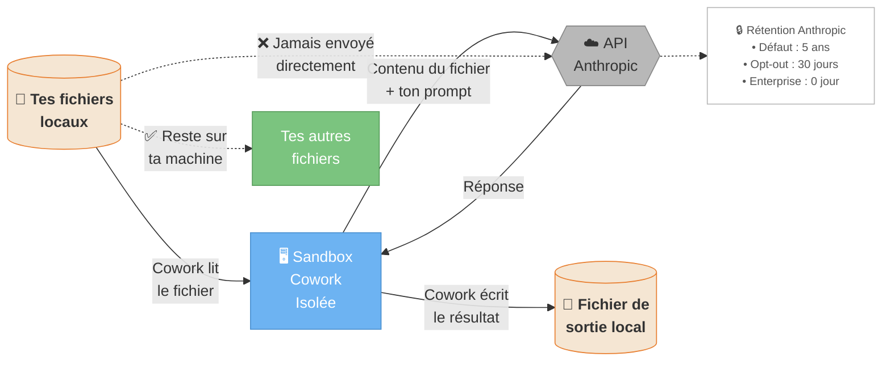
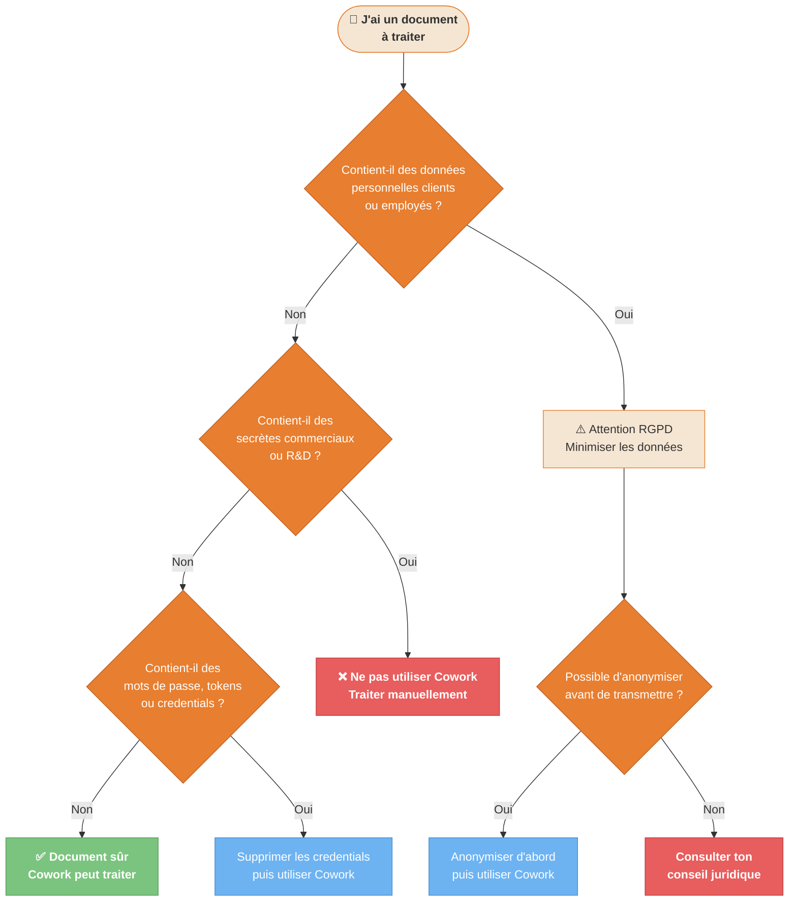

---
---
---
title: "Diagrammes — Sécurité"
description: "2 diagrammes : où vont tes données, arbre décision document sensible"
tags: [security, privacy, données, confiance]
---

# Sécurité — Diagrammes

2 diagrammes pour comprendre où vont tes données et comment décider si un document peut être traité par Cowork.

---

## D11 — Où vont mes données ? {#d11}

**Quand l'utiliser** : tu t'interroges sur la confidentialité avant de donner accès à des fichiers.



> **Action recommandée** : désactiver l'utilisation pour l'entraînement sur [claude.ai/settings/data-privacy-controls](https://claude.ai/settings/data-privacy-controls)

<details>
<summary>Fallback ASCII</summary>

```
Flux des données Cowork
========================

[Tes fichiers] → [Sandbox Cowork] → [API Anthropic] → [Réponse] → [Fichier de sortie]

Ce qui part chez Anthropic :
  ✓ Le contenu du fichier que tu as fourni
  ✓ Ton prompt

Ce qui NE part pas :
  ✗ Tes autres fichiers locaux
  ✗ Ton système de fichiers complet
  ✗ Tes mots de passe ou identifiants

Rétention par défaut : 5 ans
Opt-out disponible : claude.ai/settings/data-privacy-controls
```
</details>

---

## D13 — Dois-je laisser Cowork traiter ce document ? {#d13}

**Quand l'utiliser** : tu as un document sensible (contrat, RH, financier...) et tu hésites à le donner à Cowork.



<details>
<summary>Fallback ASCII — Règle simple</summary>

```
Document OK pour Cowork si :
  ✓ Pas de données personnelles clients/employés non anonymisées
  ✓ Pas de secrets commerciaux ou R&D critiques
  ✓ Pas de mots de passe, tokens ou credentials

Ne jamais donner à Cowork :
  ✗ Secrets de commerce, formules propriétaires
  ✗ Données RH sans anonymisation
  ✗ Fichiers .env, config avec mots de passe
  ✗ Données de santé (RGPD strict)

En cas de doute : anonymiser d'abord, traiter ensuite.
```
</details>
