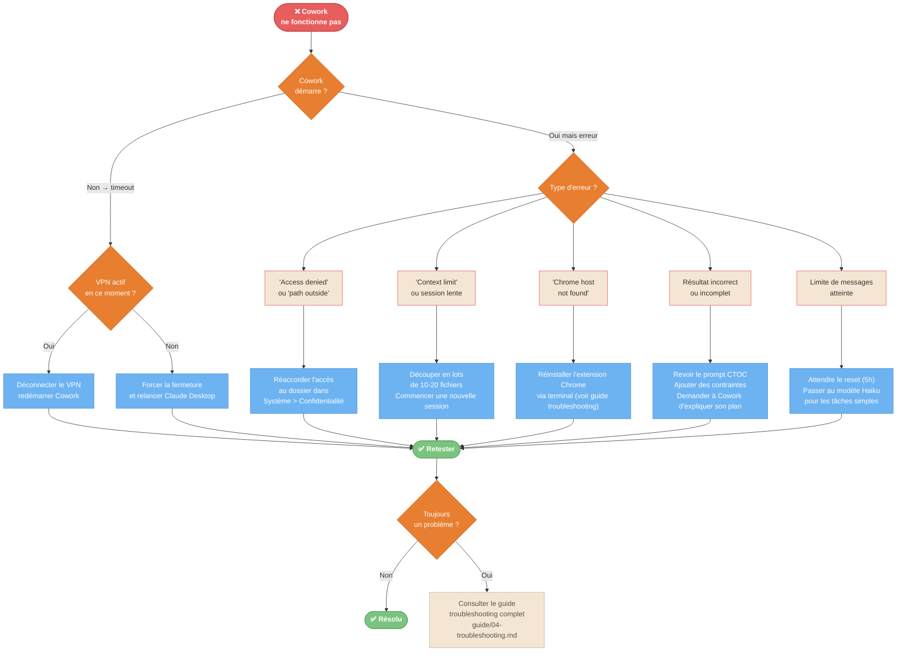

---
---
---
title: "Diagrammes — Dépannage"
description: "1 diagramme : arbre diagnostic complet quand Cowork ne fonctionne pas"
tags: [troubleshooting, diagnostic, erreurs, vpn]
---

# Dépannage — Diagrammes

---

## D15 — Arbre diagnostic "ça marche pas" {#d15}

**Quand l'utiliser** : Cowork plante, timeout, erreur, résultat mauvais. Ce diagramme couvre 90% des cas.



<details>
<summary>Fallback ASCII — Check-list de démarrage rapide</summary>

```
COWORK NE DÉMARRE PAS
  1. VPN actif ? → Déconnecter, relancer
  2. Sinon → Forcer fermeture Claude Desktop, relancer

ERREURS FRÉQUENTES
  "Access denied"        → Réaccorder accès dossier dans Préférences Système
  "Context limit"        → Découper en lots 10-20 fichiers, nouvelle session
  "Chrome host not found"→ Réinstaller extension Chrome (voir guide)
  Résultat incorrect     → Améliorer le prompt CTOC, ajouter des contraintes
  Limite messages        → Attendre reset 5h, ou utiliser Haiku pour tâches simples

RÈGLE N°1 : 90% des pannes au démarrage = VPN actif
```
</details>
