---
---
---
title: "Diagrammes — Workflows Commerciaux"
description: "3 diagrammes : pipeline prospection SIREN, framework analyse concurrence, cycle de vie client"
tags: [commercial, prospection, siren, concurrence, client]
---

# Workflows Commerciaux — Diagrammes

3 diagrammes pour les processus commerciaux : trouver des prospects, analyser la concurrence, gérer le cycle de vie client.

---

## D23 — Pipeline prospection via SIREN {#d23}

**Quand l'utiliser** : tu veux trouver de nouveaux clients professionnels et qualifier des leads depuis des bases publiques françaises.

```mermaid
flowchart LR
    A([Définir\nla cible]):::start --> B[Critères : secteur\nCAF, taille, zone géo]:::human

    B --> C[Cowork recherche\nsur Infogreffe/SIREN]:::cowork

    C --> D[Liste brute\nd'entreprises]:::doc

    D --> E[Cowork filtre et\nenrichit les données]:::cowork

    E --> F{Correspondance\navec cible ?}:::decision

    F -->|Non| G([Affiner critères]):::end
    F -->|Oui| H[Cowork génère\nfiche de qualification]:::cowork

    H --> I[Vérification\nhumaine]:::human

    I --> J{Lead\nqualifié ?}:::decision

    J -->|Non| K([Archiver\nen attente]):::end
    J -->|Oui| L[Cowork rédige\nprise de contact personnalisée]:::cowork

    L --> M[Relecture et\nenvoi par vous]:::human

    M --> N{Réponse ?}:::decision

    N -->|Intéressé| O([Passer en\npipeline client]):::end
    N -->|Pas maintenant| P[Rappel dans\n3 mois]:::human
    N -->|Non| K

    classDef start fill:#7BC47F,stroke:#5a9e5a,color:#fff,font-weight:bold
    classDef end fill:#7BC47F,stroke:#5a9e5a,color:#fff,font-weight:bold
    classDef cowork fill:#E87E2F,stroke:#c06020,color:#fff
    classDef decision fill:#6DB3F2,stroke:#4a90d0,color:#fff,font-weight:bold
    classDef doc fill:#F5E6D3,stroke:#E87E2F,color:#333
    classDef human fill:#B8B8B8,stroke:#888,color:#333
```

<details>
<summary>Fallback ASCII — Pipeline prospection SIREN</summary>

```
PIPELINE PROSPECTION
====================

1. Définir la cible (secteur, taille, zone)
   ↓
2. Cowork recherche sur Infogreffe / registre SIREN
   ↓
3. Liste brute → Cowork filtre et enrichit
   ↓
4. Qualification humaine
   ├── Non qualifié → Archive
   └── Qualifié →
5. Cowork rédige prise de contact personnalisée
   (contexte entreprise, angle d'accroche spécifique)
   ↓
6. Relecture + envoi par vous
   ↓
7. Suivi réponse
   ├── Intéressé → Pipeline client
   ├── Pas maintenant → Rappel 3 mois
   └── Non → Archive

Sources publiques : Infogreffe, Pappers.fr, Societe.com
Données disponibles : SIREN, effectif estimé, CA si disponible, dirigeants
```
</details>

---

## D24 — Framework analyse concurrentielle {#d24}

**Quand l'utiliser** : tu veux comprendre où tu te situes par rapport à tes concurrents et identifier les opportunités de différenciation.

```mermaid
flowchart TD
    A([Lancer l'analyse\nconcurrentielle]):::start --> B[Identifier 3 à 5\nconcurrents directs]:::human

    B --> C[Cowork scrape\nleurs sites web]:::cowork
    B --> D[Cowork compile\navis Google/TrustPilot]:::cowork
    B --> E[Cowork analyse\nleurs réseaux sociaux]:::cowork

    C --> F[Synthèse\npar concurrent]:::doc
    D --> F
    E --> F

    F --> G[Cowork identifie\nles patterns communs]:::cowork

    G --> H{Analyse\n4 axes}:::decision

    H --> I[Prix\net positionnement]:::doc
    H --> J[Offres\net services]:::doc
    H --> K[Points forts\ncités par clients]:::doc
    H --> L[Points faibles\ncités par clients]:::doc

    I --> M[Rapport\nconcurrentiel complet]:::cowork
    J --> M
    K --> M
    L --> M

    M --> N{Opportunités\nidentifiées ?}:::decision
    N -->|Oui| O[Cowork rédige\nstratégie de différenciation]:::cowork
    N -->|Marché saturé| P[Analyse\nde niches]:::cowork

    O --> Q([Plan d'action\npersonnalisé]):::end
    P --> Q

    classDef start fill:#E87E2F,stroke:#c06020,color:#fff,font-weight:bold
    classDef end fill:#7BC47F,stroke:#5a9e5a,color:#fff,font-weight:bold
    classDef cowork fill:#E87E2F,stroke:#c06020,color:#fff
    classDef decision fill:#6DB3F2,stroke:#4a90d0,color:#fff,font-weight:bold
    classDef doc fill:#F5E6D3,stroke:#E87E2F,color:#333
    classDef human fill:#B8B8B8,stroke:#888,color:#333
```

<details>
<summary>Fallback ASCII — Framework analyse concurrentielle</summary>

```
ANALYSE CONCURRENTIELLE
========================

Étape 1 : Identifier 3-5 concurrents directs (toi)

Étape 2 : Collecte données (Cowork)
  ├── Scraping sites web (offres, prix, positionnement)
  ├── Compilation avis Google/TrustPilot (verbatim clients)
  └── Analyse réseaux sociaux (ton, fréquence, engagement)

Étape 3 : Synthèse par concurrent (Cowork)
  ├── Prix et positionnement
  ├── Offres et services proposés
  ├── Points forts cités par les clients
  └── Points faibles cités par les clients

Étape 4 : Identification opportunités (Cowork)
  ├── Angle de différenciation non occupé
  ├── Segment sous-servi
  └── Pricing gap exploitable

Sortie : Rapport 2-3 pages + stratégie de différenciation
Fréquence recommandée : trimestrielle
```
</details>

---

## D25 — Cycle de vie client avec Cowork {#d25}

**Quand l'utiliser** : tu veux visualiser toutes les interactions client que Cowork peut automatiser ou améliorer, de la prospection à la fidélisation.

```mermaid
flowchart LR
    subgraph Acquisition["Acquisition"]
        A1[Prospect\nidentifié]:::stage --> A2[Prise de\ncontact]:::cowork
        A2 --> A3[Proposition\ncommerciale]:::cowork
    end

    subgraph Conversion["Conversion"]
        B1[Négociation]:::human --> B2[Contrat\ngénéré]:::cowork
        B2 --> B3[Signature\net onboarding]:::human
    end

    subgraph Délivrance["Délivrance"]
        C1[Suivi\nde mission]:::human --> C2[Compte-rendus\nautomatisés]:::cowork
        C2 --> C3[Facturation\ncontinue]:::cowork
    end

    subgraph Fidélisation["Fidélisation"]
        D1[Satisfaction\nclient]:::human --> D2[Rapport\nde bilan]:::cowork
        D2 --> D3[Proposition\nrenouvellement]:::cowork
        D3 --> D4[Upsell\nbasé sur historique]:::cowork
    end

    A3 --> B1
    B3 --> C1
    C3 --> D1
    D4 --> A1

    classDef stage fill:#F5E6D3,stroke:#E87E2F,color:#333
    classDef cowork fill:#E87E2F,stroke:#c06020,color:#fff
    classDef human fill:#B8B8B8,stroke:#888,color:#333
```



<details>
<summary>Fallback ASCII — Cycle de vie client</summary>

```
CYCLE DE VIE CLIENT — CE QUE COWORK AUTOMATISE
================================================

ACQUISITION
  Prospect identifié (Cowork : fiche qualification SIREN)
  → Prise de contact (Cowork : email personnalisé)
  → Proposition commerciale (Cowork : depuis template)

CONVERSION
  → Négociation (humain)
  → Contrat généré (Cowork : depuis template + données client)
  → Signature + onboarding (humain)

DÉLIVRANCE
  → Suivi de mission (humain)
  → Compte-rendus automatisés (Cowork : depuis vos notes)
  → Facturation continue (Cowork : depuis bons de travaux)

FIDÉLISATION
  → Rapport de bilan fin de mission (Cowork)
  → Proposition de renouvellement (Cowork : personnalisée)
  → Upsell basé sur l'historique (Cowork : analyse du dossier)
  → Retour en ACQUISITION pour nouvelles missions

Cowork intervient à 7 étapes sur 10.
Les 3 étapes humaines : négociation, signature, relation directe.
```
</details>
